# Домашнее задание к занятию `«Введение в Terraform»` - `Рахманов Александр`

## [Ссылка на родительский проект](https://github.com/SLOV1977/ter-homeworks/blob/main/01/hw-01.md)

### Цели задания

1. Установить и настроить Terrafrom.
2. Научиться использовать готовый код.

------

### Чек-лист готовности к домашнему заданию

1. Скачайте и установите **Terraform** версии >=1.12.0 . Приложите скриншот вывода команды ```terraform --version```.
2. Скачайте на свой ПК этот git-репозиторий. Исходный код для выполнения задания расположен в директории **01/src**.
3. Убедитесь, что в вашей ОС установлен docker.


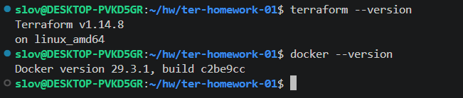

------

### Инструменты и дополнительные материалы, которые пригодятся для выполнения задания

1. Репозиторий с ссылкой на зеркало для установки и настройки Terraform: [ссылка](https://github.com/netology-code/devops-materials).
2. Установка docker: [ссылка](https://docs.docker.com/engine/install/ubuntu/). 

------
### Внимание!! Обязательно предоставляем на проверку получившийся код в виде ссылки на ваш github-репозиторий!
------

### Задание 1

1. Перейдите в каталог [**src**](https://github.com/netology-code/ter-homeworks/tree/main/01/src). Скачайте все необходимые зависимости, использованные в проекте.  

**Ответ**


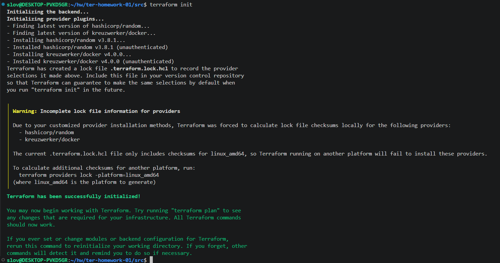

2. Изучите файл **.gitignore**. В каком terraform-файле, согласно этому .gitignore, допустимо сохранить личную, секретную информацию?(логины,пароли,ключи,токены итд)  

**Ответ**

Согласно файлу **.gitignore**, допустимо сохранять личную, секретную информацию в файле **personal.auto.tfvars**

3. Выполните код проекта. Найдите  в state-файле секретное содержимое созданного ресурса **random_password**, пришлите в качестве ответа конкретный ключ и его значение.  

**Ответ**


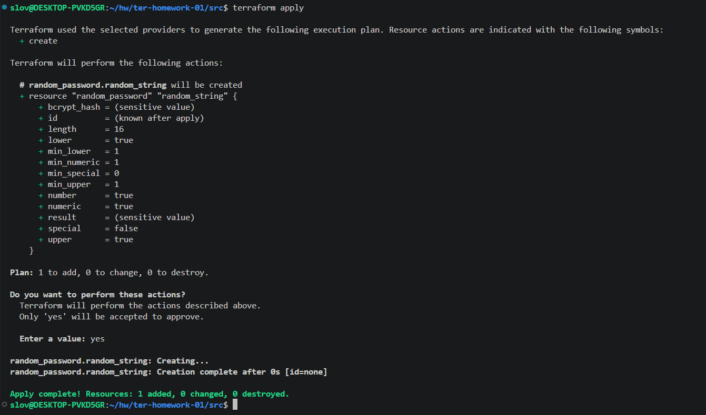


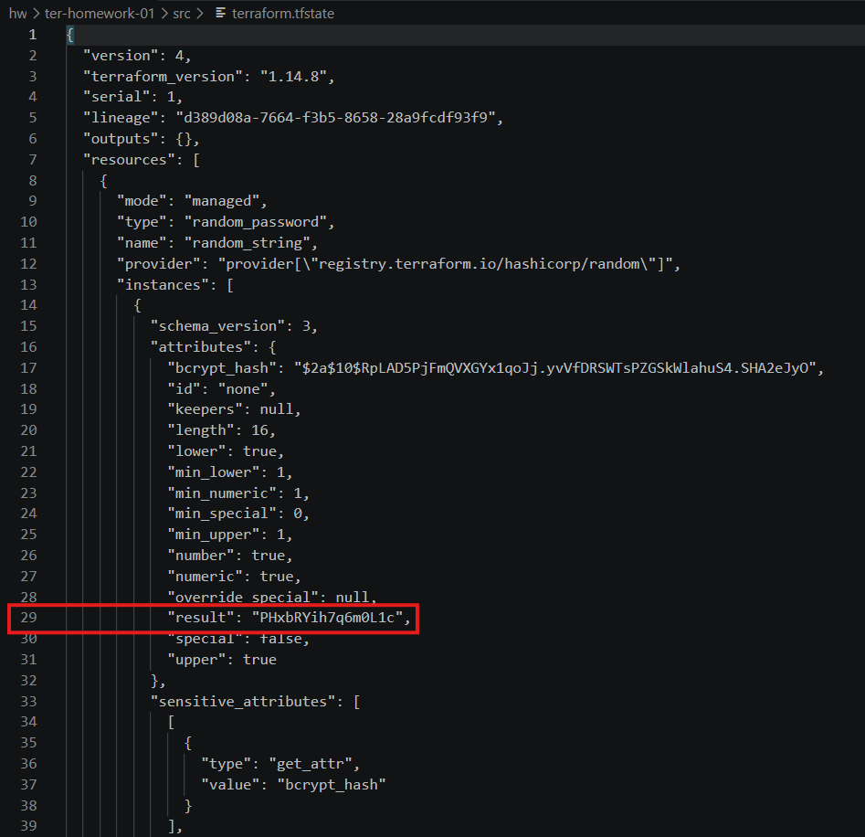

Ключ указан в строке кода 29: `"result": "PHxbRYih7q6m0L1c"`

4. Раскомментируйте блок кода, примерно расположенный на строчках 29–42 файла **main.tf**.
Выполните команду ```terraform validate```. Объясните, в чём заключаются намеренно допущенные ошибки. Исправьте их.  

**Ответ**


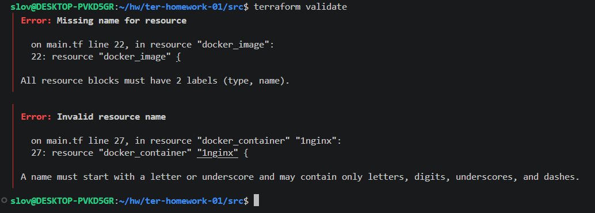

**После валидации проекта с раскомментированным участком кода, возникают следующие ошибки:**
   - `All resource blocks must have 2 labels (type, name)` - говорит о том, что блок resource должен содержать две метки - тип ресурса и локальное имя ресурса. В нашем случае тип ресурса указан `"docker_image"`, а локальное имя отсутствует.
   - `A name must start with a letter or underscore and may contain only letters, digits, underscores, and dashes` - говорит о том, что имя ресурса должно начинаться с буквы или подчеркивания и может содержать только буквы, цифры, подчеркивания и дефисы. В нашем случает имя начинается с цифры - `"1nginx"`  

**После исправления вышеописанных ошибок (если больше в коде ничего не править), при дальнейшем запуске возникнут следующие ошибки:**
   - `A managed resource "random_password" "random_string_FAKE" has not been declared in the root module` - В ссылке на ресурс используется имя `"random_string_FAKE"`, которое не соответствует реальному имени `"random_string"` объявленного ресурса `"random_password"`.
   - `This object has no argument, nested block, or exported attribute named "resulT". Did you mean "result"?` - У этого объекта нет аргумента, вложенного блока или экспортируемого атрибута с именем `"resulT"`. Вы имели в виду `"result"`? В данном проекте у нас есть параметр - `"result"`, параметра `"resulT"` - нет.  

5. Выполните код. В качестве ответа приложите: исправленный фрагмент кода и вывод команды ```docker ps```.  

**Ответ**

**Исправленный фрагмент кода:**

```
resource "docker_image" "nginx" {
  name         = "nginx:latest"
  keep_locally = true
}

resource "docker_container" "nginx" {
  image = docker_image.nginx.image_id
  name  = "hello_world"

  ports {
    internal = 80
    external = 9090
  }
}
```


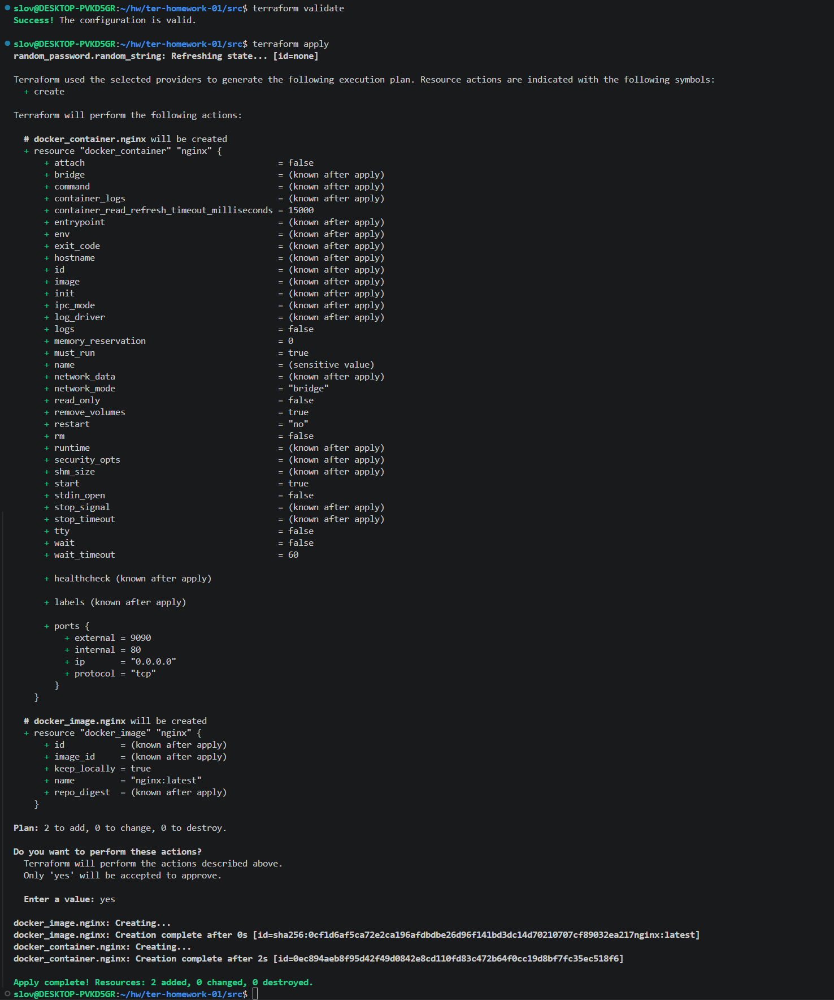


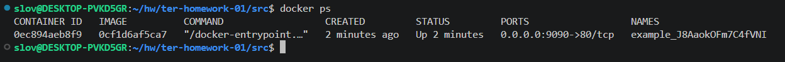  

6. Замените имя docker-контейнера в блоке кода на ```hello_world```. Не перепутайте имя контейнера и имя образа. Мы всё ещё продолжаем использовать name = "nginx:latest". Выполните команду ```terraform apply -auto-approve```.  

**Ответ**


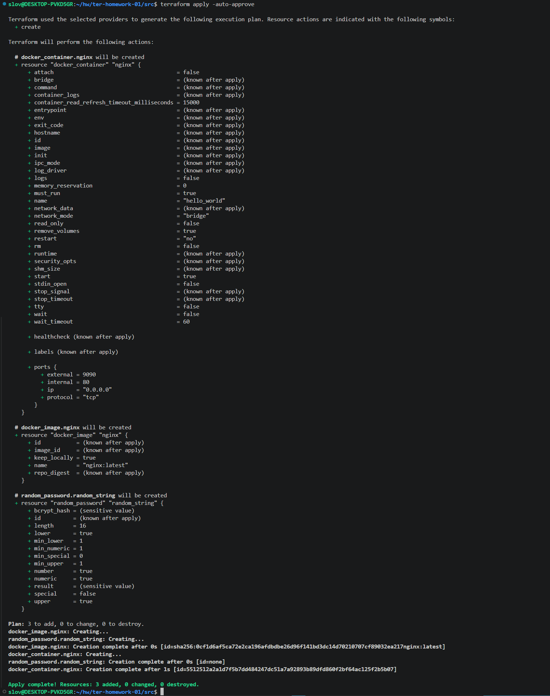

Объясните своими словами, в чём может быть опасность применения ключа  ```-auto-approve```. Догадайтесь или нагуглите зачем может пригодиться данный ключ? В качестве ответа дополнительно приложите вывод команды ```docker ps```.

**Ответ**

Флаг ```-auto-approve``` в команде ```terraform apply -auto-approve``` позволяет автоматически применить план изменений без запроса на подтверждение у пользователя.  
Применение этого флага может быть опасно, так как ошибки могут привести к необратимым изменениям инфраструктуры (например, удалению данных или уничтожению базы данных), так как отсутствует проверка плана перед применением.  
Рекомендуется применять этот флаг при автоматизации процессов, что упрощает работу в автоматизированных средах, например в CI/CD-пайплайнах, где не требуется ручное вмешательство и для экономии времени, так как не нужно каждый раз проходить этап ручного подтверждения плана изменений.  


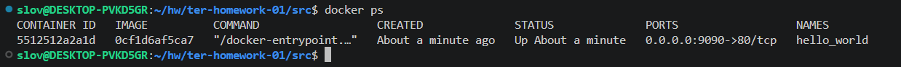  

8. Уничтожьте созданные ресурсы с помощью **terraform**. Убедитесь, что все ресурсы удалены. Приложите содержимое файла **terraform.tfstate**.  

**Ответ**


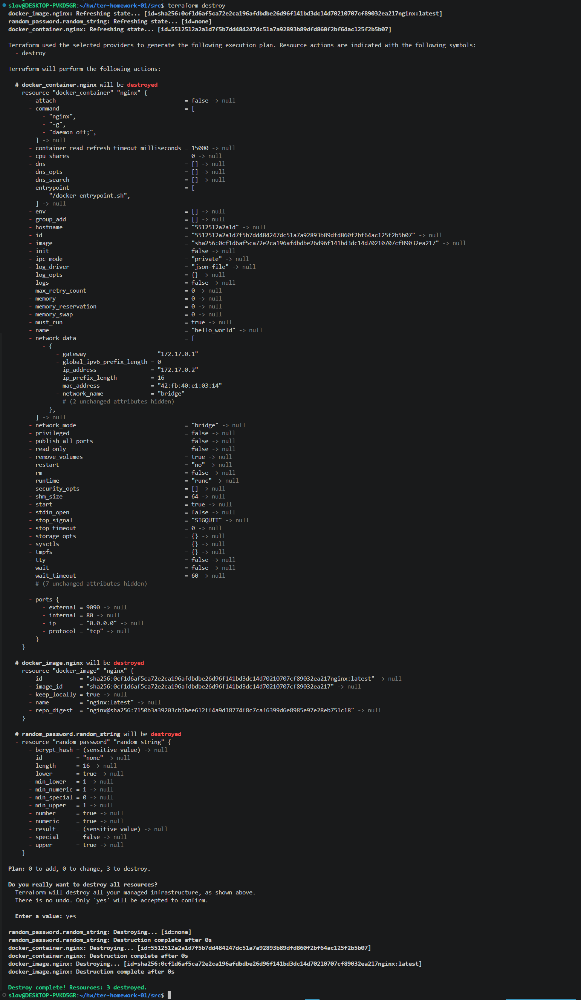


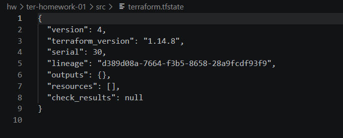  

9. Объясните, почему при этом не был удалён docker-образ **nginx:latest**. Ответ **ОБЯЗАТЕЛЬНО НАЙДИТЕ В ПРЕДОСТАВЛЕННОМ КОДЕ**, а затем **ОБЯЗАТЕЛЬНО ПОДКРЕПИТЕ** строчкой из документации [**terraform провайдера docker**](https://library.tf/providers/kreuzwerker/docker/latest).  (ищите в классификаторе resource docker_image)  

**Ответ**

После удаления созданных ресурсов с помощью команды `terraform destroy`, остался не удалённым docker-образ `nginx:latest`. Это произошло из-за того, что в ресурсе этого docker-образа присутствует аргумент `keep_locally`, который является логическим значением (Boolean). И, если это значение - `true`, то образ Docker не будет удален при операции уничтожения. Если `false`, то образ будет удален из локального хранилища Docker при операции уничтожения. В проекте `keep_locally = true`


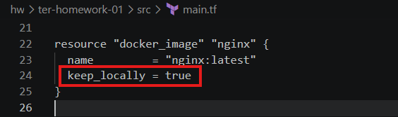


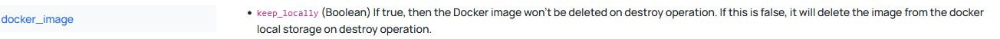

------

## Дополнительное задание (со звёздочкой*)

**Настоятельно рекомендуем выполнять все задания со звёздочкой.** Они помогут глубже разобраться в материале.   
Задания со звёздочкой дополнительные, не обязательные к выполнению и никак не повлияют на получение вами зачёта по этому домашнему заданию. 

------

### Задание 2*

1. Создайте в облаке ВМ. Сделайте это через web-консоль, чтобы не слить по незнанию токен от облака в github(это тема следующей лекции). Если хотите - попробуйте сделать это через terraform, прочитав документацию yandex cloud. Используйте файл ```personal.auto.tfvars``` и гитигнор или иной, безопасный способ передачи токена!
2. Подключитесь к ВМ по ssh и установите стек docker.
3. Найдите в документации docker provider способ настроить подключение terraform на вашей рабочей станции к remote docker context вашей ВМ через ssh.
4. Используя terraform и  remote docker context, скачайте и запустите на вашей ВМ контейнер ```mysql:8``` на порту ```127.0.0.1:3306```, передайте ENV-переменные. Сгенерируйте разные пароли через random_password и передайте их в контейнер, используя интерполяцию из примера с nginx.(```name  = "example_${random_password.random_string.result}"```  , двойные кавычки и фигурные скобки обязательны!) 
```
    environment:
      - "MYSQL_ROOT_PASSWORD=${...}"
      - MYSQL_DATABASE=wordpress
      - MYSQL_USER=wordpress
      - "MYSQL_PASSWORD=${...}"
      - MYSQL_ROOT_HOST="%"
```

6. Зайдите на вашу ВМ , подключитесь к контейнеру и проверьте наличие секретных env-переменных с помощью команды ```env```. Запишите ваш финальный код в репозиторий.

------

### Задание 3*
1. Установите [opentofu](https://opentofu.org/)(fork terraform с лицензией Mozilla Public License, version 2.0) любой версии
2. Попробуйте выполнить тот же код с помощью ```tofu apply```, а не terraform apply.
------

### Правила приёма работы

Домашняя работа оформляется в отдельном GitHub-репозитории в файле README.md.   
Выполненное домашнее задание пришлите ссылкой на .md-файл в вашем репозитории.

### Критерии оценки

Зачёт ставится, если:

* выполнены все задания,
* ответы даны в развёрнутой форме,
* приложены соответствующие скриншоты и файлы проекта,
* в выполненных заданиях нет противоречий и нарушения логики.

На доработку работу отправят, если:

* задание выполнено частично или не выполнено вообще,
* в логике выполнения заданий есть противоречия и существенные недостатки. 
